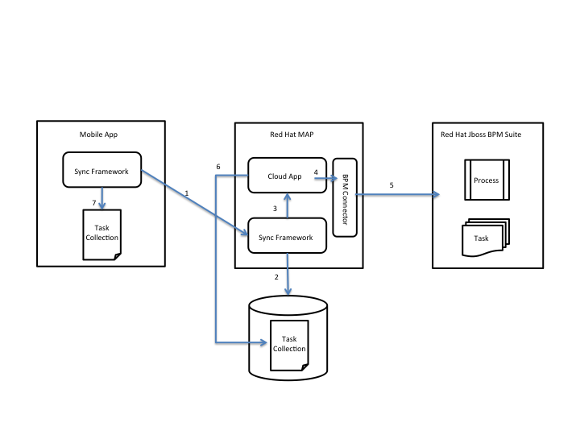

# RHMAP-BPM-Integration-Sync

## RHMAP-BPM-Integration Using Sync
For mobile users that require tasks, information or status updates asynchronously without the need of explicitly requesting them, RHMAP provides the `$fh.sync` framework. This framework makes it possible to keep a mobile app in sync with data modifications on the server and vice versa. For personnel that works according to a semi-automated process where certain tasks are performed manually, such as collecting data, Red Hat JBoss BPM Suite toghether with RHMAP provides an excellent means to combine these needs.



### Steps
```
1. The Mobile App uses the sync framework to regularly check for updates to the Task Collection.
2. The Sync Framework checks the collection for updates
3. A callback through the $fh.sync API is made to the Cloud App
4. The Cloud App calls the connector
5. The connector calls BPM to retrieve the latest processes and tasks
6. The Cloud App updates the Task Collection
7. The sync framework propagates the updated collection and stores in the local Task Collection in the Mobile App

```
### Mobile App Displaying Tasks from BPM
Task data retrieved from BPM by the Mobile App can be displayed for example as cards:


### Mobile App Displaying an in queue with Tasks from BPM
The Mobile App can display an in queue that gets updated when BPM creates new tasks:


To make a mobile app getting regular updates on changes made in tasks and processes in Red Hat JBoss BPM Suite,
the `$fh.sync` framework is used together with the [fh-connector-bpm](https://github.com/sebastianfaulhaber/fh-connector-bpm).
Using the `$fh.sync.globalInterceptRequest` function a `globalRequestInterceptor` that calls the connector on each sync cycle and then stores the result in a MongoDB Collection allows the mobile app to asynchronously retrieve the latest BPM process and task updates and present these to the user.

The following code example shows the `globalRequestInterceptor` in the Cloud App:

```
var $fh = require('fh-mbaas-api');

var globalRequestInterceptor = function(dataset_id, params, cb) {
  // This function will intercept all sync requests.
  // It is useful for checking client identities and
  // for validating authentication

  console.log('Intercepting request for dataset', dataset_id, 'with params', params);

  $fh.service({
    "guid": "guid to connector",
    "path": "/bpm/runtimeTaskQuery",
    "method": "POST",
    "headers": {
      "Content-Type" : "application/json"
    },
    "params": {
      "params": {"username": "BPM username", "password": "BPM password", "ip": "BPM ip", "port": "BPM port"}
    }
    }, function(err, body, response) {
      if ( err ) {
        console.log('service call failed - err : ' + err);
      } else {
        var options = {
          "act": "update",
          "type": "Name of collection",
          "guid": "GUID of document",
          "fields": {"Field name in document": JSON.stringify(body)}
        };
        fh.db(options, function (err, data) {
          if (err) {
            console.error("Error " + err);
          } else {
            console.log("Updated document with BPM data");
          }
        });
      }
    });

  // Return a non null response to cause the sync request to fail.
  // This (string) response will be returned to the client, so
  // don't leak any security information.
  return cb(null);
}

$fh.sync.globalInterceptRequest(globalRequestInterceptor);
```

Note that in order to reduce amount of data to be retrieved by the mobile app, all updates should be made to the same document, hence overwriting the previous update.
With this, the client app can use the $fh.sync API with the collection name as dataset Id and subscribe to updates in BPM process instances and tasks.
The following code example shows how to set up the sync framework in the mobile app:

```
var datasetId = "Name of collection";

$fh.sync.init({
  "do_console_log" : false,
  "storage_strategy" : "dom",
});

$fh.sync.manage(datasetId);

$fh.sync.notify(function(notification) {

    $fh.sync.doList(datasetId,
      function(res){

        //res is a JSON object
        for(var key in res){
          if(res.hasOwnProperty(key)){
            // Unique Id of the record, used for read, update & delete operations (string).
            var uid = key;
            // Record data, opaque to sync service.
            var rawdata = res[key].data;

            var data = JSON.parse(rawdata.<Field name in document>).taskInfoList;
            data.uid = uid;

            $scope.taskInfoList = data;

            var hash = res[key].hash;

          }
        }
        $scope.$apply();
      },
      function(code, msg){
        console.log("error: " + code + ' : ' + msg);
      }
    );
});
```
The mobile app's UI can be updated asynchronously every time there is a change in BPM's processes or tasks by using for example `$scope.$apply` in AngularJS. This will make tasks display their updated information with no need for the user to
explicitly request an update. This makes it convenient when working with multiple tasks simultaneously or while
infrequently receiving new tasks to an in queue.
Red Hat MAP together with Red Hat JBoss BPM Suite, leveraging the sync framework provide a simple way of building a process driven, asynchronous mobile apps that can be used mobile personnel.
